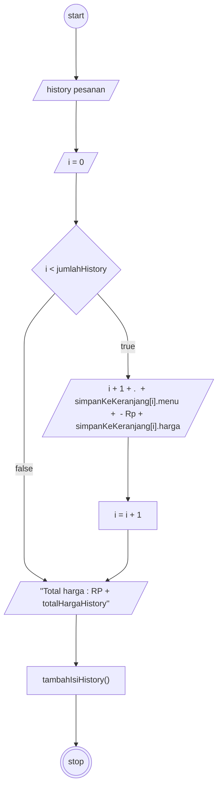

```mermaid
flowchart TB

start((start))
stop(((stop)))

pesan[/history pesanan/]

i@{shape: lean-r, label: i = 0}

while{i < jumlahHistory}

true1[/"i + 1 + .  + simpanKeKeranjang[i].menu +  - Rp + simpanKeKeranjang[i].harga"/]
iTambah@{shape: rect, label: i = i + 1}
log3[/''Total harga : RP + totalHargaHistory''/]
tambahIsiHisto["tambahIsiHistory()"]

start--->pesan--->i
while--false--->log3
i--->while--true--->true1
true1--->iTambah--->log3

log3--->tambahIsiHisto--->stop


```
