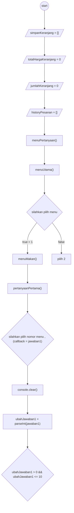

## flowchart mau ke daftar menu

```mermaid

flowchart TB

start((start))

simpanKeranjang@{shape: lean-r, label: " simpanKeranjang = []"}
jumlahKeranjang@{shape: lean-r, label: jumlahKeranjang = 0}
totalHargaKeranjang@{shape: lean-r, label: totalHargaKeranjang = 0}
historyPesanan@{shape: lean-r, label: "historyPesanan = []"}

utama@{shape: rect, label: menuPertanyaan()}
tanya@{shape: rect, label: menuUtama()}
pertanyaan1@{shape: diamond, label: silahkan pilih menu}


menu1True@{shape: rect, label: menuMakan()}
menu1TruePertanyaan@{shape: rect, label: pertanyaanPertama()}
menu1False@{shape: rect, label: pilih 2}

silahkanPilih@{shape: diamond, label: "silahkan pilih nomor menu , (callback = jawaban1)" }
clear@{shape: rect, label: console.clear()}
ubahParse@{shape: rect, label: ubahJawaban1 = parseInt(jawaban1)}
cekUbahJawaban1@{shape: diamond, label: ubahJawaban1 > 0 && ubahJawaban1 <= 10}


start--->simpanKeranjang--->totalHargaKeranjang
totalHargaKeranjang--->jumlahKeranjang--->historyPesanan


historyPesanan--->utama--->tanya
tanya--->pertanyaan1--true = 1--->menu1True
menu1True--->menu1TruePertanyaan
pertanyaan1--false--->menu1False


menu1TruePertanyaan--->silahkanPilih--->clear
clear--->ubahParse--->cekUbahJawaban1


```
